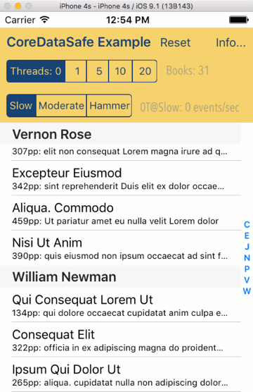

## CoreDataSafe 

Updated from Xcode 8.2.1, Swift 3, for iOS9+.
CoreDataSafe should apply to OS X as well, but not tested here.

This project contains a few different things, but the key class is CoreDataSafe. This is a simple CoreData stack (<200 lines of code) that enables effective and (almost) foolproof code to implement CoreData with both foreground and background operations. The rest of the project is just a demonstration of using it. The demo consists of 2 parts:

 1. The CoreDataTest target that demonstrates some usage and validates the operation of the stack.
 2. The iOS App that uses the CoreDataSafe to populate a TableView using an NSFectchResultsController while running background processes to update the data.

[Overview PDF](./CoreDataSafeExampleOverview.pdf)

Other Features and Notes:
 * See the layout changes under rotation of iPhones. Views are repositioned to make best use of space.
 * See info dialog as Popovers on iPhone same as iPad.
 * In running the App at max background activity, you will see CoreData occasionally logging about Validation exceptions. These occur when 2 different background threads operate on the same Entity, with one deleting it and the other updating it. CoreDataSafe is built on the concept that update wins. A delete will always trump an update, so I'm happy with the behavior and would like to silence the warning, but do not see any way to do that.
 * Always happy to hear what you think email:eric.elfner@zcage.com

